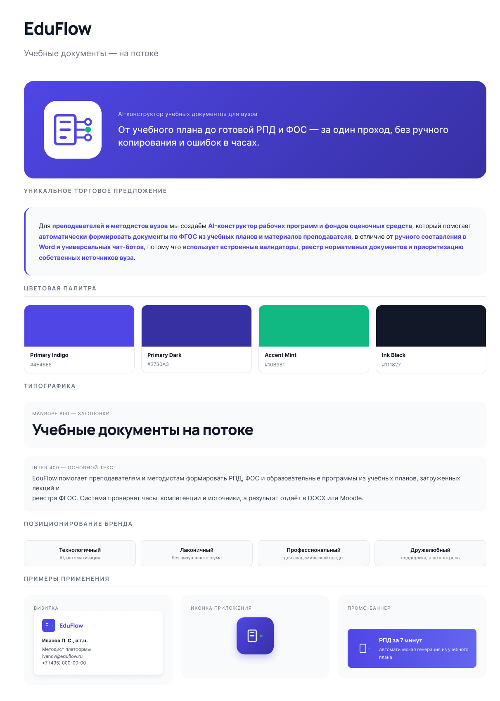

# Автоматизированный конструктор РПД на базе ИИ

Проект решает конкретную боль преподавателей и методистов: составление рабочих программ дисциплин (РПД) по ФГОС. Это долго, скучно, и часто делается копипастом из старых документов.

Мы делаем конструктор, который генерирует РПД за несколько минут из лекций, презентаций и аудиозаписей занятий. Система обучена под стандарты ФГОС и локальные шаблоны вузов, сама сопоставляет темы с матрицей компетенций и не требует промпт-инжиниринга. В отличие от универсальных чат-ботов вроде ChatGPT, результат сразу можно нести в УМУ.

## Что умеет

Генерация РПД и ФОС из загруженных материалов. Автоматическая привязка тем к индикаторам компетенций. Проверка часов, ЗЕТ и структуры документа. Экспорт в DOCX и форматы Moodle. Работает в закрытом контуре вуза.

## Brandboard

  

